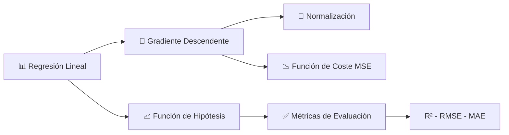

# 🚗 ft_linear_regression

> **Implementación de regresión lineal con gradiente descendente**  
> Predice el precio de un coche basándose en su kilometraje usando machine learning desde cero.

---

<div align="center">

*"A computer program is said to learn from experience **E** with respect to some class of tasks **T** and performance measure **P**, <br>
if its performance at tasks in **T**, as measured by **P**, improves with experience **E**."*

— **Tom M. Mitchell**

</div>

---

## 📋 Descripción

Este proyecto implementa un **algoritmo básico de machine learning** (regresión lineal) desde cero, sin usar librerías que hagan el trabajo automáticamente (como `numpy.polyfit`). 

🎯 **Objetivo:** Entrenar un modelo que pueda predecir el precio de un coche dado su kilometraje usando únicamente las matemáticas del gradiente descendente.

## 🎯 Características

<table>
<tr>
<td width="50%">

### ✅ Parte Obligatoria

| Componente | Descripción |
|------------|-------------|
| 🔮 **predict.py** | Predicción de precio por kilometraje |
| 🧠 **train.py** | Entrenamiento con gradiente descendente |
| 💾 **thetas.txt** | Almacenamiento de parámetros θ₀ y θ₁ |
| 📐 **Fórmulas** | Implementación exacta según subject |

</td>
<td width="50%">

### ⭐ Parte Bonus

| Componente | Descripción |
|------------|-------------|
| 📊 **visualize.py** | Gráficos de datos y regresión |
| 📈 **precision.py** | Métricas: R², MSE, RMSE, MAE, MAPE |
| 🎨 **Interfaz** | Salidas coloridas y formateadas |

</td>
</tr>
</table>

## 📊 Dataset

El archivo `data.csv` contiene datos reales de precios de coches:

| Campo | Descripción | Rango |
|-------|-------------|-------|
| **km** | Kilometraje del coche | 22,899 - 240,000 km |
| **price** | Precio del coche | 3,650€ - 8,290€ |

📌 **Total:** 24 muestras de entrenamiento

## 🚀 Instalación

### 📦 Requisitos básicos
```bash
Python 3.x  # Ya instalado en sistemas 42
```

### 🎨 Para la parte bonus (visualización)
```bash
pip install matplotlib
# o usar el Makefile
make install
```

## 💻 Uso

### 🧠 1. Entrenar el modelo

```bash
python3 train.py
# o usando Makefile
make train
```

**¿Qué hace?**
- ✓ Lee los datos de `data.csv`
- ✓ Ejecuta el algoritmo de gradiente descendente
- ✓ Guarda los parámetros θ₀ y θ₁ en `thetas.txt`
- ✓ Muestra el progreso del entrenamiento

<details>
<summary>📋 Ver ejemplo de salida</summary>

```plaintext
Cargando datos desde 'data.csv'...
Datos cargados: 24 muestras
Rango de kilometraje: 22899 - 240000 km
Rango de precios: 3650 - 8290€

Iniciando entrenamiento con 24 muestras...
Learning rate: 0.1, Iteraciones: 1000
Iteración 1/1000 - MSE: 0.500000
Iteración 100/1000 - MSE: 0.021234
...
Iteración 1000/1000 - MSE: 0.002145

Parámetros guardados en 'thetas.txt'
θ0 = 8499.72
θ1 = -0.021893

¡Entrenamiento completado exitosamente!
```
</details>

---

### 🔮 2. Predecir precios

```bash
python3 predict.py
# o usando Makefile
make predict
```

**Ejemplo interactivo:**
```plaintext
Introduce el kilometraje del coche: 50000
Precio estimado para 50000 km: 7405.07€
```

---

### 📊 3. Visualizar resultados (Bonus)

```bash
python3 visualize.py
# o usando Makefile
make visualize
```

**Muestra un gráfico con:**
- 🔵 Puntos azules → datos originales
- 🔴 Línea roja → regresión lineal calculada

---

### 📈 4. Evaluar precisión (Bonus)

```bash
python3 precision.py
# o usando Makefile
make precision
```

**Métricas calculadas:**

| Métrica | Descripción |
|---------|-------------|
| **R²** | Coeficiente de determinación (0-1, donde 1 es perfecto) |
| **MSE** | Error cuadrático medio |
| **RMSE** | Raíz del MSE (en la misma escala que los datos) |
| **MAE** | Error absoluto medio |
| **MAPE** | Error porcentual medio |

<details>
<summary>📋 Ver ejemplo de salida</summary>

```plaintext
============================================================
         EVALUACIÓN DE PRECISIÓN DEL MODELO
============================================================

Parámetros del modelo:
  θ₀ (intersección): 8,499.72
  θ₁ (pendiente):    -0.02189331

Número de muestras: 24

Métricas de precisión:
  R² (Coef. determinación): 0.8642
    → Buen ajuste

  MSE (Error cuadrático medio):  156,234.52
  RMSE (Raíz del MSE):           395.27€
  MAE (Error absoluto medio):    324.18€
  MAPE (Error porcentual medio): 4.82%

============================================================

Interpretación:
  • El modelo explica el 86.42% de la varianza en los precios
  • Error promedio de ±324€ en las predicciones
  • Error típico (RMSE) de ±395€
============================================================
```
</details>

## 🧮 Algoritmo

### 📐 Función de hipótesis

```math
estimatePrice(mileage) = θ₀ + (θ₁ × mileage)
```

### 🎯 Gradiente Descendente

Las fórmulas implementadas según el subject:

```math
tmpθ₀ = learningRate × (1/m) × Σ(estimatePrice(mileage[i]) - price[i])
```

```math
tmpθ₁ = learningRate × (1/m) × Σ((estimatePrice(mileage[i]) - price[i]) × mileage[i])
```

**Donde:**

| Variable | Significado |
|----------|-------------|
| **m** | Número de muestras en el dataset |
| **learningRate** | Tasa de aprendizaje (0.1 por defecto) |
| **θ₀, θ₁** | Parámetros del modelo (se actualizan simultáneamente) |

### 🔄 Normalización

Para mejorar la convergencia del algoritmo:
1. 📊 **Normaliza** los datos durante el entrenamiento
2. 🧠 **Entrena** el modelo con datos normalizados
3. 🔙 **Desnormaliza** los parámetros θ al finalizar
4. 💾 **Guarda** los parámetros listos para usar con datos originales

## 📁 Estructura de archivos

```plaintext
ft_linear_regression/
│
├── 📄 data.csv              # Dataset de entrenamiento (24 muestras)
│
├── 🔮 predict.py            # Programa de predicción (OBLIGATORIO)
├── 🧠 train.py              # Programa de entrenamiento (OBLIGATORIO)
├── 💾 thetas.txt            # Parámetros guardados (generado por train.py)
│
├── 📊 visualize.py          # Visualización gráfica (BONUS)
├── 📈 precision.py          # Cálculo de precisión (BONUS)
│
├── 🛠️  Makefile             # Automatización de comandos
├── 🧪 test_project.py       # Suite de pruebas
├── 📝 README.md             # Documentación principal
└── 🚫 .gitignore            # Archivos ignorados por git
```

## ⚙️ Parámetros ajustables

Puedes modificar el comportamiento del entrenamiento editando `train.py`:

```python
# Configuración del entrenamiento
theta0, theta1 = train_model(
    mileages, 
    prices, 
    learning_rate=0.1,     # 📊 Tasa de aprendizaje
    iterations=1000        # 🔄 Número de iteraciones
)
```

| Parámetro | Valor por defecto | Descripción |
|-----------|-------------------|-------------|
| `learning_rate` | 0.1 | Velocidad de aprendizaje del algoritmo |
| `iterations` | 1000 | Número de veces que se actualizan los θ |

💡 **Tip:** Si el MSE no converge, prueba reduciendo el `learning_rate`.

## ✅ Cumplimiento del Subject

<table>
<tr>
<td width="50%">

### 📋 Parte Obligatoria

| Requisito | Estado |
|-----------|--------|
| Programa de predicción | ✅ |
| Programa de entrenamiento | ✅ |
| Fórmulas especificadas | ✅ |
| Actualización simultánea θ₀ y θ₁ | ✅ |
| Almacenamiento de parámetros | ✅ |
| Sin librerías prohibidas | ✅ |

</td>
<td width="50%">

### ⭐ Parte Bonus

| Requisito | Estado |
|-----------|--------|
| Gráfico de datos | ✅ |
| Gráfico de regresión | ✅ |
| Cálculo de precisión | ✅ |

</td>
</tr>
</table>

> 🎉 **Resultado:** Proyecto 100% completo y listo para evaluación

## 🔍 Notas técnicas

<details>
<summary><b>1. 🔄 Normalización de datos</b></summary>

Se normalizan los datos para evitar problemas de escala y mejorar la convergencia del gradiente descendente. Esto es especialmente importante cuando los valores de entrada (km) y salida (precio) tienen rangos muy diferentes.

</details>

<details>
<summary><b>2. 🔙 Desnormalización de parámetros</b></summary>

Los parámetros θ se desnormalizan antes de guardarlos para que funcionen directamente con datos en su escala original, sin necesidad de normalizar en el programa de predicción.

</details>

<details>
<summary><b>3. 🎯 Valores iniciales</b></summary>

Antes del primer entrenamiento, θ₀ y θ₁ son 0, por lo que todas las predicciones serán 0. Esto es correcto según el subject.

</details>

<details>
<summary><b>4. 📉 Convergencia</b></summary>

El MSE (Mean Squared Error) mostrado durante el entrenamiento debe disminuir progresivamente. Si aumenta o se mantiene constante, considera ajustar el learning rate.

</details>

## 🎓 Conceptos aprendidos



- 📊 **Regresión lineal simple** con una variable
- 🎯 **Gradiente descendente** para optimización
- 🔄 **Normalización** de datos para mejor convergencia
- 📉 **Función de coste** (MSE - Mean Squared Error)
- 📈 **Métricas de evaluación** (R², RMSE, MAE, MAPE)
- 📊 **Visualización** de datos y modelos

---

<div align="center">

## 📝 Autor

**Proyecto ft_linear_regression**  
🏫 42 Málaga - Campus 42  
👤 sternero  
📅 2025

---

## 📄 Licencia

Este proyecto es parte del currículum de **42 School**.

[](https://www.42malaga.com/)

</div>
